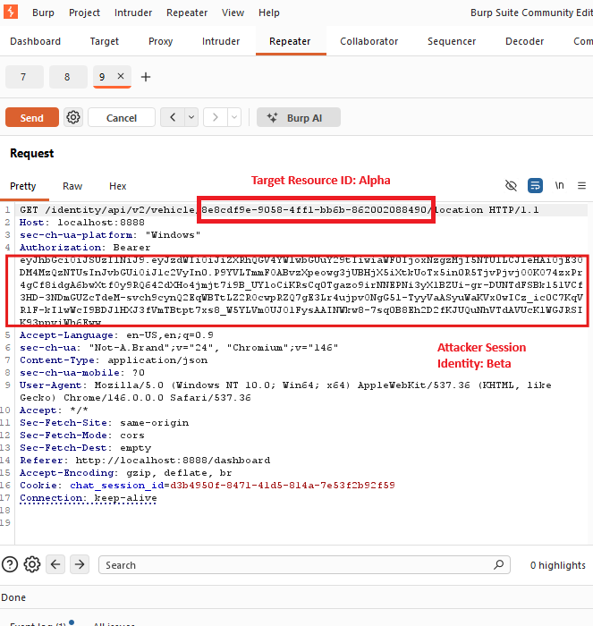
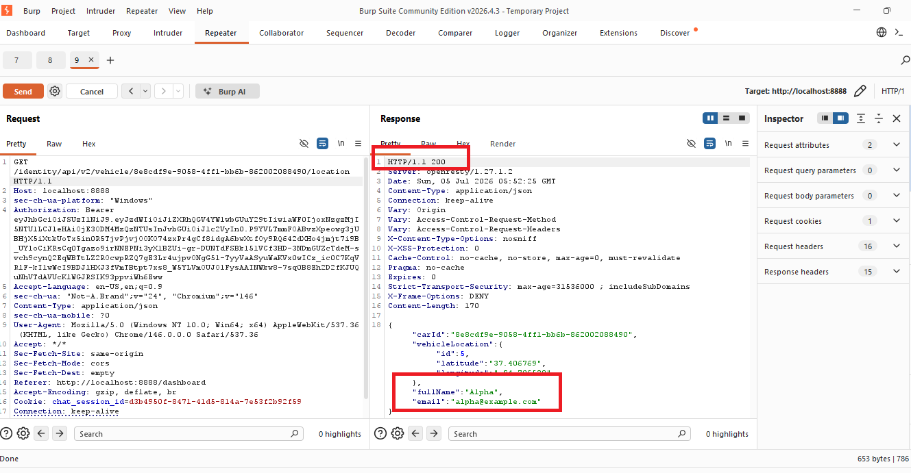
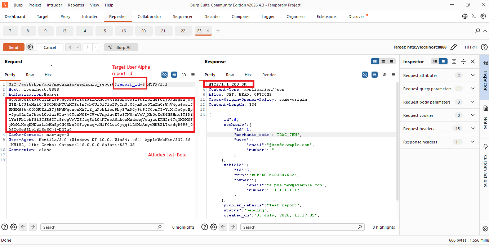

# Broken Object Level Authorization (BOLA)

## OWASP API Top 10

**A01:2025 – Broken Access Control**

**API1:2023 – Broken Object Level Authorization**

**CVSS v3.1:** 8.1 (High)

---

## Description

Broken Object Level Authorization (BOLA) occurs when an API exposes resources based on user-supplied object identifiers without verifying ownership. By manipulating these identifiers, an authenticated attacker can gain unauthorized access to resources belonging to other users.

---
## Business Impact

- Unauthorized access to customer information.
- Exposure of sensitive business data.
- Privacy and confidentiality violations.
- Increased risk of data enumeration and regulatory non-compliance.

---
## Evidence

### Challenge 1 – Access Another User's Vehicle

**Request (Attacker Session)**

The authenticated user (**Beta**) intercepted the request in Burp Suite and replaced the vehicle identifier with **Alpha's Vehicle ID**. The request was sent using Beta's valid JWT without modifying the authentication token.

**Response**

The server returned **HTTP 200 OK** along with **Alpha's** vehicle information, including the owner's **full name** and **email address**, demonstrating that the API failed to validate object ownership.

---

### Challenge 2 – Access Another User's Mechanic Report

Using the authenticated **Beta** session, the `report_id` parameter was modified to reference **Alpha's mechanic report**. The API responded with **HTTP 200 OK**, exposing another user's mechanic report, vehicle information, and associated account details without performing an authorization check.

## Remediation

- Enforce server-side object ownership validation.
- Validate authorization for every API request.
- Use indirect object references or UUIDs where appropriate.
- Return **403 Forbidden** for unauthorized access attempts.

---

## Tools Used

- Burp Suite Community Edition
- Docker
- OWASP crAPI